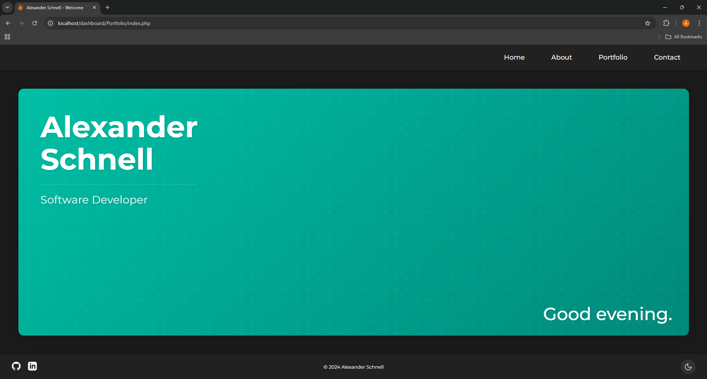
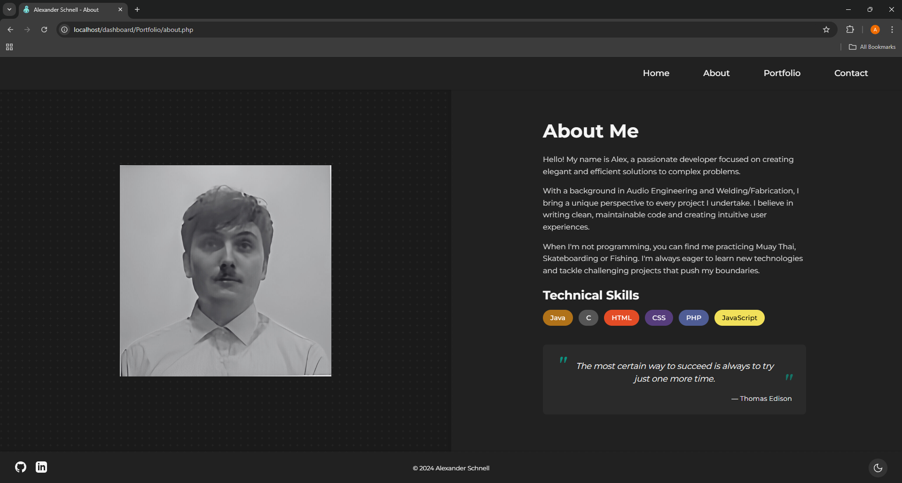
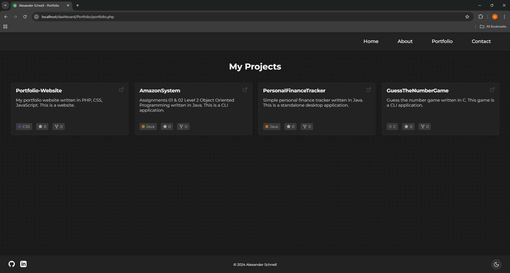
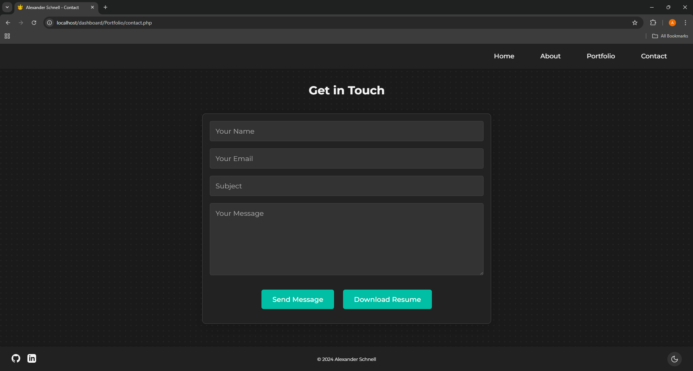

# Portfolio Website

This project is a personal portfolio website designed with simplicity and elegance in mind. It showcases my work and skills through a clean and intuitive interface.

# Technology Stack

## Frontend

HTML 5\
CSS 3\
JavaScript

## Backend

PHP\
Apache Server

## Development Environment

XAMPP v8.2.12\
Control Panel v3.3.0

## Features

Welcome Page: A clean landing page that introduces visitors to the site\
About Section: Professional background and personal information\
Portfolio Gallery: Showcase of projects and work samples\
Contact Form: Direct communication channel for visitors\
Responsive Design: Optimized for all device sizes\
Clean Navigation: Intuitive menu system for easy site exploration

# Installation and Setup

## Prerequisites

Install XAMPP (version 8.2.12 or higher)\
Ensure ports 80 and 443 are available for Apache

## Installation Steps

1. Clone this repository to your XAMPP htdocs folder
2. Start XAMPP Control Panel
3. Start Apache server
4. Access the site at: http://localhost/dashboard/Portfolio/index.php

## Project Structure

Portfolio/\
├── assets/\
│   ├── docs/\
│   └── images/\
├── css/\
│   ├── about.css\
│   ├── contact.css\
│   ├── index.css\
│   └── portfolio.css\
├── js/\
│   ├── dark-mode.js\
│   ├── github-repos.js\
│   └── greeting.js\
├── .gitignore\
├── about.php\
├── composer.json\
├── composer.lock\
├── contact.php\
├── index.php\
├── portfolio.php\
└── README.md

# Development

## Local Development

Make sure XAMPP is running with Apache server active
Development URL: http://localhost/dashboard/Portfolio/index.php
Changes to PHP files are reflected immediately
Clear browser cache if CSS/JS changes don't appear

# Screenshots

Here's the welcome page:

Here's the about page:

Here's the portfolio page:

Here's the contact page:

